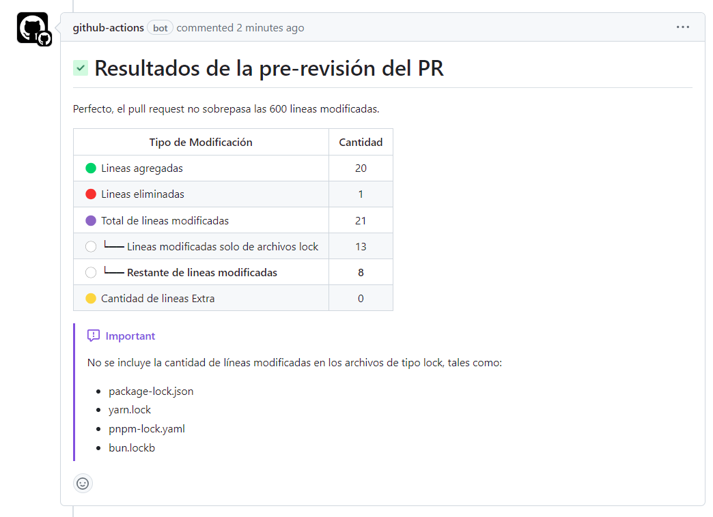

# Memoria técnica de la verificación de número de líneas modificadas en el pull request

## 1. Iniciar action workflow

- Este archivo yml se ejecutará la primera vez que se cree un nuevo pull request, también cada vez que se actualize el pr
- Damos los permisos de escritura
- Designamos el entorno de ejecución
- Declaramos las variables de entorno que vamos a usar para las tareas
- Indicamos la versión de actions que vamos a usar

```yml
on:
  pull_request:
    branches: '*'

permissions: write-all

jobs:
  check_pr_size:
    environment: dev
    env:
      GITHUB_TOKEN: ${{ secrets.GITHUB_TOKEN }}
      MAX_LINES_PR: ${{ vars.MAX_LINES_PR || 600 }}
      PR_COMMENTS_URL: ${{ github.event.pull_request.comments_url }}
      PR_ADDITIONS: ${{ github.event.pull_request.additions }}
      PR_DELETIONS: ${{ github.event.pull_request.deletions }}
    runs-on: ubuntu-latest
    steps:
      - uses: actions/checkout@v2
        with:
          fetch-depth: 0

      ... more tasks
```

## 2. Obtener el total de numero de líneas cambiadas de todos los archivos de tipo lock

- Tenemos un script que ejecuta `git diff --stat origin/NOMBRE_RAMA`, de donde vamos a obtener el numero de líneas cambiadas de todos lo archivos de tipo lock
- El resultado se guardará dentro de una variable PR_MODIFY_LOCK, luego lo guardamos como una nueva variable de entorno

```yml
- name: Obtain the total number of modified lines of the lock files
  env:
    PR_DESTINATION_BRANCH: ${{ github.event.pull_request.base.ref }}
  run: |
    chmod +x bash-scripts/lines-of-lock.sh

    PR_MODIFY_LOCK=$(bash-scripts/lines-of-lock.sh)

    echo "PR_MODIFY_LOCK=${PR_MODIFY_LOCK}" >> $GITHUB_ENV
```

## 3. Calcular los valores para el reporte

- Calculamos el numero de lienas editadas en total
- Calculamos el numero de líneas editadas sin contar el numero de líneas editadas de tipo lock
- Calculamos el numero de líneas restantes
- Finalmente los guardamos como nuevas variables de entorno

```yml
- name: Obtaining missing data for reporting purposes
  run: |
    PR_MODIFY_ALL=$(($PR_ADDITIONS + $PR_DELETIONS))
    PR_MODIFY_REST=$(($PR_MODIFY_ALL - $PR_MODIFY_LOCK))

    if [ $PR_MODIFY_REST -gt $MAX_LINES_PR ]; then
        PR_EXTRA=$(($PR_MODIFY_REST - $MAX_LINES_PR))
    else
        PR_EXTRA=0
    fi

    echo "PR_MODIFY_ALL=${PR_MODIFY_ALL}" >> $GITHUB_ENV
    echo "PR_MODIFY_REST=${PR_MODIFY_REST}" >> $GITHUB_ENV
    echo "PR_EXTRA=${PR_EXTRA}" >> $GITHUB_ENV
```

## 4. Generar el mensaje que se va mostrar en el reporte

- Primero generamos la nota, para el reporte
- Usamos la plantilla que tenemos del reporte y haciendo uso de sed vamos a reemplazar las variables
- Finamente guardamos el mensaje como una nueva variable de entorno

```yml
- name: Generate the message for commenting on the pr
  run: |
    if [[ $PR_MODIFY_REST -gt $MAX_LINES_PR ]]; then
      NOTE="@${{ github.actor }} Ups, tu pull request tiene más de $MAX_LINES_PR líneas modificadas, tienes un total de $PR_MODIFY_REST, considera dividir este pull request."
    else
      NOTE="Perfecto, el pull request no sobrepasa las $MAX_LINES_PR líneas modificadas."
    fi

    MESSAGE=$(sed \
        -e ':a;N;$!ba;s/\r//g' \
        -e 's/\n/\\n/g' \
        -e "s/NOTE/$NOTE/" \
        -e "s/PR_ADDITIONS/$PR_ADDITIONS/" \
        -e "s/PR_DELETIONS/$PR_DELETIONS/" \
        -e "s/PR_MODIFY_ALL/$PR_MODIFY_ALL/" \
        -e "s/PR_MODIFY_LOCK/$PR_MODIFY_LOCK/" \
        -e "s/PR_MODIFY_REST/$PR_MODIFY_REST/" \
        -e "s/PR_EXTRA/$PR_EXTRA/" templates/pr-report.md)

    echo "MESSAGE=${MESSAGE}" >> $GITHUB_ENV
```

## 5. Eliminar los reportes anteriores de los comentarios

- Realizamos una petición para obtener una lista de todos los comentarios
- Filtramos la lista por los que contengan la frase "Resultados de la pre-revisión del PR"
- Obtenemos una lista de IDs de los comentarios restantes
- Recorremos la lista para eliminar cada uno de ellos

```yml
- name: Remove previous reports from comments
  run: |
    COMMENTS=$(curl -L \
        -H "Accept: application/vnd.github+json" \
        -H "Authorization: token $GITHUB_TOKEN" \
        -H "X-GitHub-Api-Version: 2022-11-28" \
        $PR_COMMENTS_URL | jq '.[] | select(.body | contains("Resultados de la pre-revisión del PR"))')

    COMMENTS_ID=$(echo "$COMMENTS" | jq -r '.id')

    IFS=$'\n'
    for ID in $COMMENTS_ID; do

        COMMENT_URL="${{ github.api_url }}/repos/${{ github.repository }}/issues/comments/$ID"

        curl -L \
            -X DELETE \
            -H "Accept: application/vnd.github+json" \
            -H "Authorization: token $GITHUB_TOKEN" \
            -H "X-GitHub-Api-Version: 2022-11-28" \
            $COMMENT_URL
    done
```

## 6. Mostramos el reporte como comentario en el pull request

- Realizamos una petición para agregar el nuevo mensaje, enviando el mensaje que guardamos antes como una variable de entorno

```yml
- name: Shows the report as a comment in the pr
  run: |
    curl \
    -X POST \
    $PR_COMMENTS_URL \
    -H "Content-Type: application/json" \
    -H "Authorization: token $GITHUB_TOKEN" \
    --data "{ \"body\": \"$MESSAGE\" }"
```

## 7. Comprobar si la cantidad de líneas modificadas no sobrepasa el limite

- Comprobamos que el numero de líneas modificadas no superé el limite establecido, en caso se superé el limite mostrar un error de tal manera que no permita realizar el merge, hasta que se realizen las modificaciones

```yml
- name: Stop the execution of the workflow if the limit of modified lines is exceeded.
  run: |
    if [[ $PR_MODIFY_REST -gt $MAX_LINES_PR ]]
    then
        echo "Warning - total lines changed is greater than" $MAX_LINES_PR.
        echo "Please consider breaking this PR down."
        exit 1
    fi
```

## 8. Resultados

- Si el numero de líneas modificadas no supera el limite establecido



- Si el numero de líneas modificadas supera el limite establecido


