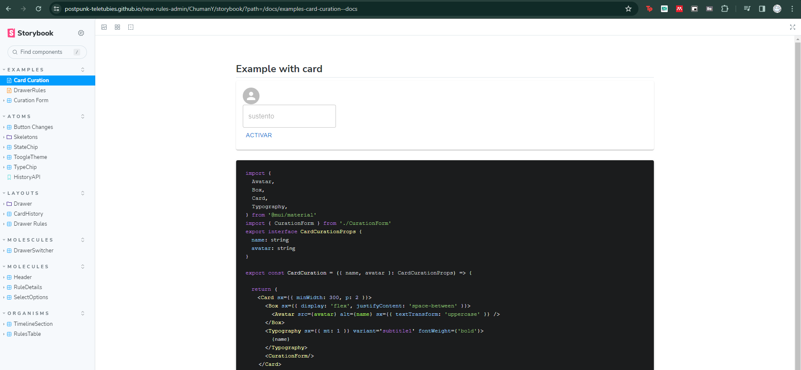

# ¿Por qué se realizó la implementación de un Storybook para cada Developer?
Hemos optado por organizar nuestro Storybook de manera individualizada por autor para mejorar diversos aspectos del desarrollo del proyecto.
## **Motivaciones:**
### **1. Colaboración Eficiente:**
   - La división por autor proporciona a cada desarrollador un espacio exclusivo para mostrar y probar sus propios componentes, facilitando la colaboración sin interferencias.

### **2. Seguimiento Individual:**
   - La estructura permite un seguimiento claro de los aportes de cada desarrollador, ya que las rutas específicas como `storybook/ChumanY` y `storybook/jaenfigueroa` facilitan la revisión y evaluación de componentes por autor.

### **3. Facilita la Revisión y Pruebas:**
   - Al organizar los componentes de esta manera, se simplifica la revisión y prueba de funcionalidades, ya que los revisores pueden centrarse en un conjunto específico sin distracciones.

### **4. Mejora la Navegación:**
   - La estructura jerárquica del Storybook facilita la navegación, permitiendo a los desarrolladores acceder directamente a la sección que les concierne, mejorando la eficiencia y reduciendo el tiempo de búsqueda.

# ¿Cómo se realizó la implementación de un Storybook para cada Developer?
Se creo un archivo de configuración para GitHub Actions, que se utiliza para automatizar el proceso de construcción y despliegue de un Storybook en GitHub Pages cuando se realizan cambios y se hace un push con un tag que coincida con el patrón 'dev-storybook*'

```yml
on:
  push:
    tags:
      - 'dev-storybook*'
    paths:
      - './'

permissions:
  contents: write
  pages: write

jobs:
  build:
    runs-on: ubuntu-latest

    steps:
      - name: Checkout
        uses: actions/checkout@v3
      - name: Set up Node
        uses: actions/setup-node@v3
        with:
          node-version: 18
      - uses: pnpm/action-setup@v2
        with:
          version: 8
          run_install: false
      - name: Build
        working-directory: ./src
        run: |
          pnpm install
          pnpm build-storybook
      - name: Deploy to GitHub Pages
        uses: peaceiris/actions-gh-pages@v3
        with:
          github_token: ${{ secrets.GITHUB_TOKEN }}
          publish_dir: ./storybook-static
          destination_dir: ${{ github.actor }}/storybook
```
# Archivo de Configuración de GitHub Actions

## Trigger
```yml
on:
  push:
    tags:
      - 'dev-storybook*'
    paths:
      - './'
```
Este bloque especifica que la acción se activará cuando se realice un push y el tag cumpla con el patrón 'dev-storybook*', además de verificar cambios en el directorio actual ('./').

## Permissions
```yml
permissions:
  contents: write
  pages: write
```
Define los permisos necesarios para escribir en los contenidos y las páginas de GitHub.

## Jobs
```yml
jobs:
  build:
    runs-on: ubuntu-latest
```
Define un trabajo llamado 'build' que se ejecutará en un entorno basado en Ubuntu.

## Steps
```yml
steps:
  - name: Checkout
    uses: actions/checkout@v3
  - name: Set up Node
    uses: actions/setup-node@v3
    with:
      node-version: 18
  - uses: pnpm/action-setup@v2
    with:
      version: 8
      run_install: false
  - name: Build
    working-directory: ./src
    run: |
      pnpm install
      pnpm build-storybook
  - name: Deploy to GitHub Pages
    uses: peaceiris/actions-gh-pages@v3
    with:
      github_token: ${{ secrets.GITHUB_TOKEN }}
      publish_dir: ./storybook-static
      destination_dir: ${{ github.actor }}/storybook
```
Estos son los pasos que realiza el trabajo:

### 1. Checkout
   - Descarga el código fuente del repositorio.

### 2. Set up Node
   - Configura el entorno Node.js en la versión 18.

### 3. pnpm/action-setup
   - Configura el entorno para utilizar pnpm (un gestor de paquetes de Node.js).

### 4. Build
   - Entra al directorio './src', instala las dependencias con pnpm y ejecuta el comando 'build-storybook' para construir el Storybook.

### 5. Deploy to GitHub Pages
   - Utiliza el Action de GitHub Pages para desplegar el contenido construido en el directorio './storybook-static' en las GitHub Pages.
   - La subcarpeta específica se basa en el nombre del actor (usuario que realizó el push).
   - El token de acceso de GitHub es proporcionado por la variable secreta 'GITHUB_TOKEN'.

# Resultados

- Para poder ingresar al storybook por autor, en el apartado de "ChumanY" cada uno tendrá que escribir su usuario de GitHub **IMPORTANTE: EL NOMBRE ES CASE SENSITIVE POR LO CUAL DEBE ESTAR ESCRITO TAL CUAL SU USUARIO DE GITHUB, RESPETANDO MAYÚSCULAS Y MINÚSCULAS**.
- Ejemplo:


- Una vez escrito se desplegará el storybook con sus respectivos componentes.
