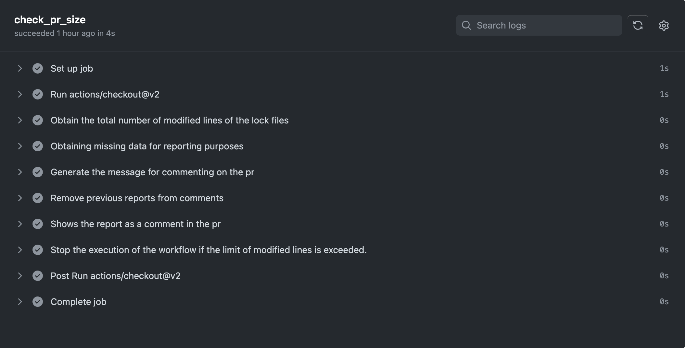

# Implementación de SonarCloud para Cobertura de Código en Pull Requests

## Instalar sonnarqube-scanner

Como primer paso se debe instalar el sonnarqube-scanner como dependencia de desarrollo.

```bash
pnpm add sonarqube-scanner --save-dev
```

## Instalar vitest con generación de coverage

En este paso, se hará la instalación de vitest.

```bash
pnpm add -D vitest
```

Luego se hace la respectiva configuración para la generación del coverage.

```ts
test:{
    environment: 'jsdom',
    coverage: {
      provider: 'v8',
      all: true,
      reporter: ['lcov', 'text'],
    },
  }
```

En el caso del repositorio actual, se hizo la configuración en el archivo vite.config.ts, también es valido colocarlo en un archivo vitest.config.ts, pero para mejores practicas se harán todas las configuraciones en el archivo vite.config.ts .

## Configuración del Package.json

Dentro del script, se colocará lo siguiente para generar el coverage.

```json
    "test": "vitest",
    "coverage": "vitest run --coverage",
```

- "test": "vitest": Este script es para ejecutar tus pruebas. Cuando corres pnpm run test desde la línea de comandos, se ejecutará Vitest. Vitest buscará archivos de prueba en tu proyecto (generalmente archivos con nombres que terminan en .test.js o .spec.js) y ejecutará las pruebas que encuentre en esos archivos. Es una manera estándar de ejecutar todas tus pruebas para asegurarte de que tu código funciona como se espera.

- "coverage": "vitest run --coverage": Este script se utiliza para generar un informe de cobertura de código al ejecutar tus pruebas. Al usar pnpm run coverage, Vitest ejecutará todas las pruebas como lo hace el script "test", pero además, recopilará datos sobre qué partes de tu código fueron ejecutadas durante las pruebas. Esto es útil para identificar partes del código que no están siendo probadas, lo que puede ayudar a escribir pruebas más completas y mejorar la calidad del código.

## Configuración de github actions

Se tendra la siguiente arquitectura para el actions: 

-- .github
    -- workflows
        -- sonarcloud.yml

Ahora dentro del archivo sonarcloud.yml se hará la siguiente configuración:

```yml
name: Sonarcloud

on:
 pull_request:
   types: [opened, synchronize, reopened]
jobs:
  sonarcloud:
    name: SonarCloud
    runs-on: ubuntu-latest
    steps:
      - name: Checkout
        uses: actions/checkout@v3
      - name: Set up Node
        uses: actions/setup-node@v3
        with:
          node-version: 18
      - uses: pnpm/action-setup@v2
        with:
          version: 8
          run_install: false
      - name: Test
        working-directory: ./src
        run: |
          pnpm install
          pnpm coverage
      - name: SonarCloud Scan
        uses: SonarSource/sonarcloud-github-action@master
        env:
          SONAR_TOKEN: ${{ secrets.SONARCLOUD_TOKEN }}
```

Este archivo automatiza el proceso de ejecución de pruebas y análisis de calidad de código cada vez que se realiza una operación en un Pull Request. Utiliza SonarCloud para el análisis de código y está configurado para trabajar con un proyecto Node.js que utiliza PNPM como gestor de paquetes. La configuración asegura que el código se revise automáticamente en términos de calidad y cobertura de pruebas, lo cual es una práctica común en el desarrollo de software moderno para mantener altos estándares de calidad.

Si se ejecuta correctamente, deberia visualizar de esta manera: 


